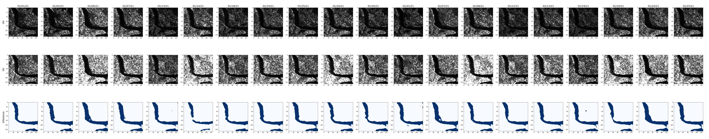

# Learning Deep Models from Weak Labels for Water Surface Segmentation in SAR Images



Repository of the paper "[Learning Deep Models from Weak Labels for Water Surface Segmentation in SAR Images](https://ieeexplore.ieee.org/document/9554647)" presented at IGARSS 2021.


Test data and architecture weights available on Zenodo! Download from [here](https://zenodo.org/record/5707779) or with the following lines:

```console
pip install zenodo-get
zenodo_get 5707779
```

Or you can play directly with the notebook!     

[](https://colab.research.google.com/github/francescoasaro/IGARSS21/blob/main/notebooks/IGARSS21.ipynb)
